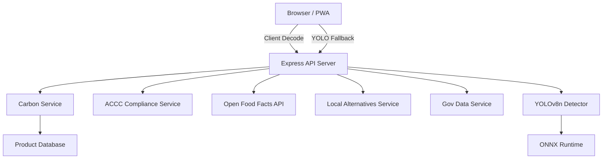

# EcoCart

**Supermarket Carbon Footprint Scanner** -- Scan product barcodes, estimate cradle-to-shelf carbon emissions, and discover local eco-friendly alternatives.

[](LICENSE)
[](https://nodejs.org/)
[](#testing)

---

## Architecture



The backend follows a layered architecture with dependency injection. Route handlers receive service instances through a factory pattern, keeping modules testable and loosely coupled.

## Features

- **Barcode scanning** -- Multi-pass client-side decoding with 4 image preprocessing variants (grayscale+contrast, adaptive binarization, sharpening); server-side YOLOv8n fallback for difficult images
- **Product recognition** -- YOLOv8n object detection (ONNX Runtime) identifies product categories from photos; locates barcode regions for targeted decoding
- **Carbon footprint estimation** -- Production, transport, and packaging emissions based on per-category emission factors and configurable transport modes
- **Eco alternatives** -- Recommends local produce, organic options, minimal packaging, and plant-based alternatives with per-item CO2 savings and price comparison
- **ACCC greenwashing detection** -- Flags vague or certification-required sustainability claims with risk-level assessment
- **Nearby eco store map** -- Leaflet-based interactive map showing nearby refill, organic, and zero-waste stores with distance data
- **Open Food Facts integration** -- Enriches product data from the global open database, including product images
- **Scan history** -- localStorage-backed history with total CO2 savings tracker
- **PWA support** -- Installable, offline-capable with Workbox runtime caching for API and OFF responses
- **Internationalization** -- English and Chinese UI via i18next
- **Privacy-first** -- In-memory-only image processing, zero data retention, Privacy Act 1988 compliant
- **Graceful degradation** -- Four-level fallback: client decode -> YOLO region decode -> YOLO category only -> manual entry prompt

## Tech Stack

| Layer      | Technologies                                                       |
|------------|--------------------------------------------------------------------|
| Backend    | Node.js 18+, Express 4, ONNX Runtime, Sharp, Multer, Helmet       |
| Frontend   | React 19, Vite 8, Chart.js, Leaflet, ZXing, Canvas preprocessing  |
| Data       | 1 220+ Australian products, Open Food Facts API                    |
| DevOps     | Docker, GitHub Actions CI, ESLint, Prettier, Jest                  |

## Project Structure

```
ecoCart/
  server.js                   # Entry point, starts HTTP server
  server/
    app.js                    # Express app setup, DI container
    routes/
      barcode.js              # Barcode scan, lookup, and YOLO pipeline endpoints
      alternatives.js         # Local alternatives endpoint
      pages.js                # Static page routes
    services/
      carbon.js               # Carbon footprint calculations
      barcode.js              # Barcode decoding logic
      yolo-detector.js        # YOLOv8n ONNX inference (singleton, lazy-loaded)
      accc.js                 # ACCC greenwashing checks
      alternatives.js         # Local alternatives lookup
      gov-data.js             # Government data integration
      open-food-facts.js      # OFF API client
    middleware/
      validation.js           # Request validation rules
      security.js             # Security headers and rate limiting
      error-handler.js        # Centralized error handling
    utils/
      helpers.js              # Shared utility functions
      image-preprocess.js     # Sharp-based image preprocessing for ONNX + barcode cropping
    __tests__/
      api.test.js             # API integration tests
  client/
    src/
      main.jsx                # React entry point
      App.jsx                 # Root component with routing
      components/             # Reusable UI components
      pages/                  # Page-level views (Home, Results, History, Settings)
      hooks/                  # Custom React hooks
      i18n/                   # Internationalization config and locales
      styles/                 # Global CSS
      utils/                  # Browser-side utilities
    public/                   # Static assets (PWA icons, favicons)
    vite.config.js            # Vite build configuration
  config/
    index.js                  # Centralized configuration
  data/
    australian-products.json  # Product catalog (1 220+ items)
    australian-keywords.json  # OCR keyword heuristics
  models/
    README.md                 # Instructions to download YOLOv8n ONNX model
    yolov8n.onnx              # YOLOv8n ONNX model (~12MB, not in git)
  scripts/
    generate-products.js      # Product data generator
  .github/
    workflows/ci.yml          # GitHub Actions CI pipeline
```

## Getting Started

### Prerequisites

- Node.js 18 or later
- npm 9 or later
- Python 3.8+ (only for YOLO model export, one-time setup)

### Install

```bash
# Clone the repository
git clone https://github.com/<your-org>/ecoCart.git
cd ecoCart

# Install backend dependencies
npm install

# Install frontend dependencies
cd client && npm install && cd ..

# Download YOLOv8n ONNX model (requires Python + ultralytics)
pip install ultralytics
python -c "from ultralytics import YOLO; YOLO('yolov8n.pt').export(format='onnx'); import shutil; shutil.move('yolov8n.onnx', 'models/yolov8n.onnx')"
```

### Configure

Create a `.env` file in the project root:

```env
PORT=5000
NODE_ENV=development
CORS_ORIGIN=http://localhost:5173   # Comma-separated allowed origins for production
```

### Run

```bash
# Development (backend with auto-reload)
npm run dev

# Development (frontend dev server, separate terminal)
npm run client

# Production
npm start
```

The backend serves at `http://localhost:5000`. The Vite dev server (default port 5173) proxies API requests to the backend.

## API Documentation

| Method | Path                     | Description                                              |
|--------|--------------------------|----------------------------------------------------------|
| POST   | `/api/scan-barcode`      | Upload a barcode image; returns carbon data, claims, and alternatives |
| GET    | `/api/lookup-barcode`    | Lookup a barcode by query parameter `barcode`            |
| POST   | `/api/lookup-barcode`    | Submit a decoded barcode; same response as scan without image upload |
| POST   | `/api/local-alternatives`| Find nearby eco stores by category and location          |
| GET    | `/`                      | Serve the React frontend                                 |
| GET    | `/privacy-policy`        | Serve the privacy policy page                            |

### POST /api/scan-barcode

**Request:** `multipart/form-data` with an `image` field (max 5 MB).

The server runs YOLOv8n object detection on the uploaded image, extracts barcode candidate regions, and returns detection results along with carbon data.

**Response (abbreviated):**

```json
{
  "barcode": { "detected": false, "code": null },
  "yoloDetection": {
    "category": "bottle",
    "confidence": 0.87,
    "bbox": { "x": 120, "y": 50, "w": 300, "h": 450 },
    "allDetections": []
  },
  "barcodeRegions": [
    { "base64": "...", "bbox": { "x": 120, "y": 330, "w": 300, "h": 135 } }
  ],
  "carbonFootprint": {
    "co2_kg": 1.23,
    "production_emissions": 1.1,
    "transport_emissions": 0.08,
    "packaging_emissions": 0.05
  },
  "ecoClaims": { "claims": [] },
  "alternatives": [],
  "acccCompliance": {
    "acccCompliance": {
      "status": "compliant",
      "riskLevel": "low",
      "warnings": [],
      "recommendations": []
    }
  }
}
```

### POST /api/lookup-barcode

**Request:**

```json
{ "barcode": "9330777000015", "detectionMethod": "client-decode" }
```

### POST /api/local-alternatives

**Request:**

```json
{ "productCategory": "Food", "userLocation": { "lat": -33.8688, "lng": 151.2093 } }
```

## Architecture Details

The Express application is assembled in `server/app.js` using a dependency-injection pattern:

1. **Config** is loaded from `config/index.js` and `.env`.
2. **Services** (carbon, barcode, YOLO detector, ACCC, alternatives, gov-data, open-food-facts) are instantiated with config and data.
3. **Routes** receive service references through a `deps` object, avoiding global singletons.
4. **Middleware** layers handle validation, security headers, rate limiting, and error normalization.
5. **YOLO detector** is a singleton that lazily loads the ONNX model on first inference request, then caches it in memory.

This structure keeps every module independently testable -- services can be mocked or stubbed without touching the Express app.

### Scan Flow

The barcode scanning pipeline uses a four-level fallback strategy:

1. **Client multi-pass decode** -- 4 Canvas-preprocessed image variants (original, grayscale+contrast, adaptive binarization, sharpening) each tried with native BarcodeDetector then ZXing WASM
2. **YOLO region decode** -- If client decode fails, upload image to server; YOLOv8n detects products and crops barcode candidate regions; client tries decoding each cropped region
3. **YOLO category only** -- If no barcode found in regions, display detected product category with confidence score and prompt manual barcode entry
4. **Manual retry** -- If everything fails, ask user to retake the photo

When client-side decoding succeeds, the image is also sent to the server asynchronously for YOLO product category enrichment (fire-and-forget).

## Testing

The project uses Jest with Supertest for integration tests.

```bash
# Run all tests
npm test

# Run tests in watch mode
npm run test:watch

# Generate coverage report
npm run test:coverage
```

The test suite includes over 120 tests covering API endpoints, service logic, and edge cases.

## Deployment

### Docker

```bash
# Build the image
docker build -t ecocart .

# Run the container
docker run -p 5000:5000 --env-file .env ecocart
```

### CI

GitHub Actions runs linting and tests on every push. The workflow is defined in `.github/workflows/ci.yml`.

## Scripts

| Command               | Description                          |
|-----------------------|--------------------------------------|
| `npm start`           | Start the production server          |
| `npm run dev`         | Start backend with nodemon           |
| `npm run client`      | Start the Vite frontend dev server   |
| `npm run build`       | Build the React frontend for production |
| `npm test`            | Run the Jest test suite              |
| `npm run test:watch`  | Run tests in watch mode              |
| `npm run test:coverage`| Generate test coverage report       |
| `npm run lint`        | Lint JavaScript files with ESLint    |
| `npm run lint:fix`    | Auto-fix linting issues              |
| `npm run format`      | Format code with Prettier            |
| `npm run format:check`| Check formatting without writing     |

## Data Sources

- **Local product database** -- 1 220+ Australian supermarket products with per-category emission factors, origin locations, and default weights (curated dataset)
- **Open Food Facts** -- Global open product database for barcode enrichment
- **Government data service** -- Australian product origin and certification lookup (barcode prefix-based heuristics; real AFSIS integration pending government API access)
- **Transport factors** -- Mode-specific emission rates (air, sea, rail, road) used for freight estimation
- **City distance table** -- Major Australian inter-city distances for domestic freight calculation

## License

MIT License. See the [LICENSE](LICENSE) file for details.
