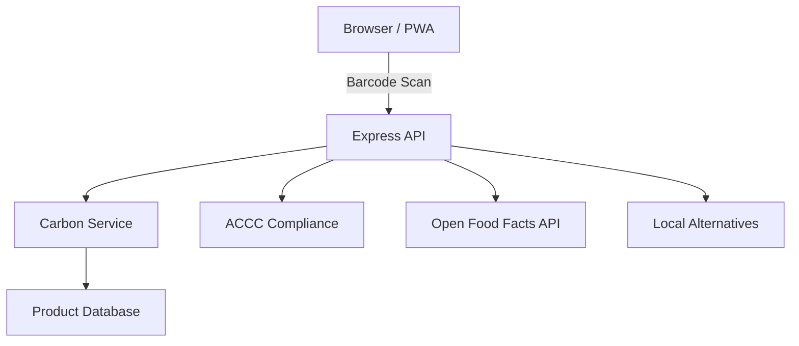

# EcoCart Full Upgrade Implementation Plan

> **For Claude:** REQUIRED SUB-SKILL: Use superpowers:executing-plans to implement this plan task-by-task.

**Goal:** Transform EcoCart from a monolithic prototype into a polished, production-grade portfolio project with React frontend, test coverage, PWA support, and deployment pipeline.

**Architecture:** Express backend split into routes/services/middleware layers; Vite + React frontend with component-based architecture; Chart.js for data visualization; Service Worker for offline support.

**Tech Stack:** Node.js 18+, Express, Jest, Supertest, Vite, React 18, Chart.js, react-i18next, Workbox, Docker, GitHub Actions.

---

## Phase 1: Backend Refactor + Tests + Security

### Task 1: Initialize test infrastructure

**Files:**
- Modify: `package.json` (add jest, supertest devDependencies, test script)
- Create: `jest.config.js`

**Step 1: Install test dependencies**

Run:
```bash
cd D:/codeproject/ecoCart
npm install --save-dev jest supertest
```

**Step 2: Create jest.config.js**

Create `jest.config.js`:
```js
/** @type {import('jest').Config} */
module.exports = {
  testEnvironment: 'node',
  coverageDirectory: 'coverage',
  collectCoverageFrom: [
    'server/**/*.js',
    '!server/**/__tests__/**'
  ],
  testMatch: ['**/__tests__/**/*.test.js']
};
```

**Step 3: Add test script to package.json**

Add to `scripts` in `package.json`:
```json
"test": "jest --verbose",
"test:watch": "jest --watch",
"test:coverage": "jest --coverage"
```

**Step 4: Verify test runner works**

Run: `npx jest --version`
Expected: version number printed

**Step 5: Commit**

```bash
git add package.json package-lock.json jest.config.js
git commit -m "chore: add Jest test infrastructure"
```

---

### Task 2: Extract utility functions

**Files:**
- Create: `server/utils/helpers.js`
- Create: `server/utils/__tests__/helpers.test.js`

**Step 1: Write failing tests for utility functions**

Create `server/utils/__tests__/helpers.test.js`:
```js
const {
  roundEmission,
  normalizeTransportMethod,
  isAustralianBarcode,
  identifyBarcodeType,
  getBarcodeConfidence,
  resolveProductCategory,
  resolveOriginLocation,
  resolveWeight,
  resolveEmissionFactor
} = require('../helpers');

describe('roundEmission', () => {
  test('rounds to 3 decimal places', () => {
    expect(roundEmission(1.23456)).toBe(1.235);
  });
  test('handles zero', () => {
    expect(roundEmission(0)).toBe(0);
  });
  test('handles string input', () => {
    expect(roundEmission('2.5')).toBe(2.5);
  });
  test('handles null/undefined', () => {
    expect(roundEmission(null)).toBe(0);
    expect(roundEmission(undefined)).toBe(0);
  });
});

describe('normalizeTransportMethod', () => {
  test('normalizes air methods', () => {
    expect(normalizeTransportMethod('Air Freight')).toBe('air');
    expect(normalizeTransportMethod('air')).toBe('air');
  });
  test('normalizes sea methods', () => {
    expect(normalizeTransportMethod('Sea Shipping')).toBe('sea');
  });
  test('normalizes rail methods', () => {
    expect(normalizeTransportMethod('Rail Transport')).toBe('rail');
  });
  test('defaults to road_truck', () => {
    expect(normalizeTransportMethod('truck')).toBe('road_truck');
    expect(normalizeTransportMethod(null)).toBe('road_truck');
    expect(normalizeTransportMethod(undefined)).toBe('road_truck');
  });
});

describe('isAustralianBarcode', () => {
  test('detects Australian EAN-13 barcodes', () => {
    expect(isAustralianBarcode('9300300000000')).toBe(true);
    expect(isAustralianBarcode('9330777000015')).toBe(true);
    expect(isAustralianBarcode('9371234567890')).toBe(true);
  });
  test('rejects non-Australian barcodes', () => {
    expect(isAustralianBarcode('6931234567890')).toBe(false);
    expect(isAustralianBarcode('0012345678901')).toBe(false);
  });
  test('handles edge cases', () => {
    expect(isAustralianBarcode('')).toBe(false);
    expect(isAustralianBarcode()).toBe(false);
  });
});

describe('identifyBarcodeType', () => {
  test('identifies EAN-13', () => {
    expect(identifyBarcodeType('9330777000015')).toBe('EAN-13');
  });
  test('identifies EAN-8', () => {
    expect(identifyBarcodeType('12345678')).toBe('EAN-8');
  });
  test('identifies UPC-A', () => {
    expect(identifyBarcodeType('012345678905')).toBe('UPC-A');
  });
  test('identifies CODE-128/39', () => {
    expect(identifyBarcodeType('ABC123')).toBe('CODE-128/39');
  });
});

describe('resolveWeight', () => {
  const defaultWeights = { generic_food: 0.3, milk: 1.0 };
  test('uses reported weight when available', () => {
    const result = resolveWeight({ weight_kg: 0.5 }, 'milk', defaultWeights);
    expect(result).toEqual({ weightKg: 0.5, weightSource: 'reported' });
  });
  test('uses estimated label when source is estimated', () => {
    const result = resolveWeight({ weight_kg: 0.5, weight_source: 'estimated' }, 'milk', defaultWeights);
    expect(result).toEqual({ weightKg: 0.5, weightSource: 'estimated' });
  });
  test('falls back to category default', () => {
    const result = resolveWeight({}, 'milk', defaultWeights);
    expect(result).toEqual({ weightKg: 1.0, weightSource: 'estimated' });
  });
  test('falls back to generic default', () => {
    const result = resolveWeight({}, 'unknown_cat', defaultWeights);
    expect(result).toEqual({ weightKg: 0.3, weightSource: 'estimated' });
  });
});

describe('resolveEmissionFactor', () => {
  const factorMap = { generic_food: 2, milk: 1.5 };
  test('uses profile factor when numeric', () => {
    expect(resolveEmissionFactor(3.2, 'milk', factorMap)).toBe(3.2);
  });
  test('falls back to category factor', () => {
    expect(resolveEmissionFactor(undefined, 'milk', factorMap)).toBe(1.5);
  });
  test('falls back to generic', () => {
    expect(resolveEmissionFactor(undefined, 'unknown', factorMap)).toBe(2);
  });
});
```

**Step 2: Run tests to verify they fail**

Run: `npx jest server/utils/__tests__/helpers.test.js`
Expected: FAIL -- module not found

**Step 3: Create server/utils/helpers.js**

Extract and export all pure utility functions from `server.js`:
- `roundEmission`
- `normalizeTransportMethod`
- `isAustralianBarcode`
- `identifyBarcodeType`
- `getBarcodeConfidence`
- `resolveProductCategory`
- `resolveOriginLocation`
- `resolveWeight` (accept defaultWeights and emissionFactorMap as parameters instead of closures)
- `resolveEmissionFactor` (accept emissionFactorMap as parameter)

Sign the function signatures so they accept their dependencies explicitly rather than relying on module-level closures. Example:

```js
function resolveWeight(profile = {}, categoryCode, defaultWeights = {}, fallbackWeight = 0.3) {
  if (typeof profile.weight_kg === 'number') {
    const source = profile.weight_source?.toLowerCase() === 'estimated' ? 'estimated' : 'reported';
    return { weightKg: profile.weight_kg, weightSource: source };
  }
  const fallback = defaultWeights[categoryCode] ?? defaultWeights['generic_food'] ?? fallbackWeight;
  return { weightKg: fallback, weightSource: 'estimated' };
}
```

**Step 4: Run tests to verify they pass**

Run: `npx jest server/utils/__tests__/helpers.test.js --verbose`
Expected: All tests PASS

**Step 5: Commit**

```bash
git add server/utils/helpers.js server/utils/__tests__/helpers.test.js
git commit -m "feat: extract utility functions with unit tests"
```

---

### Task 3: Extract carbon calculation service

**Files:**
- Create: `server/services/carbon.js`
- Create: `server/services/__tests__/carbon.test.js`

**Step 1: Write failing tests**

Create `server/services/__tests__/carbon.test.js`:
```js
const { buildCarbonFootprint, generateEstimatedProfile } = require('../carbon');

describe('buildCarbonFootprint', () => {
  const deps = {
    afsisCategories: new Set(['milk', 'generic_food']),
    validOrigins: new Set(['Australia/Victoria']),
    defaultWeights: { generic_food: 0.3, milk: 1.0 },
    emissionFactorMap: { generic_food: 2, milk: 1.5 },
    transportFactors: { air: 0.84, sea: 0.02, road_truck: 0.096, rail: 0.025 }
  };

  const sampleProduct = {
    name: 'Test Milk',
    brand: 'TestBrand',
    origin: 'Australia',
    category: 'Dairy',
    barcode: '9330777000015',
    carbonFootprint: {
      product_category: 'milk',
      origin_location: 'Australia/Victoria',
      weight_kg: 1.0,
      emission_factor: 1.5,
      distance_km: 500,
      transport_method: 'road_truck',
      production_method: 'conventional',
      packaging: 'plastic',
      is_fresh_food: false
    },
    certifications: ['Australian Made'],
    ecoClaims: []
  };

  test('calculates total emissions correctly', () => {
    const result = buildCarbonFootprint(sampleProduct, deps);
    expect(result.co2_kg).toBeGreaterThan(0);
    expect(result.production_emissions).toBeCloseTo(1.5, 3); // 1.0 * 1.5
    expect(result.transport_emissions).toBeCloseTo(0.048, 3); // (1.0/1000)*500*0.096*1.0
    expect(result.packaging_emissions).toBe(0.05);
    expect(result.confidence).toBe('high');
    expect(result.productName).toBe('Test Milk');
  });

  test('applies air freight adjustment for fresh food', () => {
    const freshProduct = {
      ...sampleProduct,
      carbonFootprint: {
        ...sampleProduct.carbonFootprint,
        is_fresh_food: true,
        transport_method: 'air'
      }
    };
    const result = buildCarbonFootprint(freshProduct, deps);
    expect(result.adjustment_factor).toBe(5.5);
  });
});

describe('generateEstimatedProfile', () => {
  const deps = {
    afsisCategories: new Set(['generic_food']),
    validOrigins: new Set(['Australia/Victoria']),
    defaultWeights: { generic_food: 0.3 },
    emissionFactorMap: { generic_food: 2 },
    transportFactors: { road_truck: 0.096 },
    packagingEmissions: 0.05,
    defaultOrigin: 'Australia/Victoria'
  };

  test('generates a valid estimated profile', () => {
    const result = generateEstimatedProfile('medium', deps);
    expect(result.co2_kg).toBeGreaterThan(0);
    expect(result.confidence).toBe('medium');
    expect(result.brand).toBe('Unknown');
  });
});
```

**Step 2: Run tests to verify they fail**

Run: `npx jest server/services/__tests__/carbon.test.js`
Expected: FAIL

**Step 3: Create server/services/carbon.js**

Extract `buildCarbonFootprintResponse` and `generateEstimatedCarbonProfile` from `server.js`. Refactor to accept a `deps` object containing afsisCategories, validOrigins, defaultWeights, emissionFactorMap, transportFactors, packagingEmissions.

Use the helper functions from `server/utils/helpers.js`.

**Step 4: Run tests to verify they pass**

Run: `npx jest server/services/__tests__/carbon.test.js --verbose`
Expected: All tests PASS

**Step 5: Commit**

```bash
git add server/services/carbon.js server/services/__tests__/carbon.test.js
git commit -m "feat: extract carbon calculation service with tests"
```

---

### Task 4: Extract barcode service

**Files:**
- Create: `server/services/barcode.js`
- Create: `server/services/__tests__/barcode.test.js`

**Step 1: Write failing tests**

```js
const { extractBarcode } = require('../barcode');

describe('extractBarcode', () => {
  test('returns client-required message', async () => {
    const result = await extractBarcode();
    expect(result.detected).toBe(false);
    expect(result.code).toBeNull();
    expect(result.detectionMethod).toBe('client-required');
  });
});
```

**Step 2: Run tests to verify they fail**

Run: `npx jest server/services/__tests__/barcode.test.js`
Expected: FAIL

**Step 3: Create server/services/barcode.js**

Extract `extractBarcode` from `server.js`. This is the function that returns the "client-required" stub.

**Step 4: Run tests to verify they pass**

Run: `npx jest server/services/__tests__/barcode.test.js --verbose`
Expected: PASS

**Step 5: Commit**

```bash
git add server/services/barcode.js server/services/__tests__/barcode.test.js
git commit -m "feat: extract barcode service"
```

---

### Task 5: Extract ACCC service

**Files:**
- Move: `accc-compliance.js` -> `server/services/accc.js`
- Create: `server/services/__tests__/accc.test.js`

**Step 1: Write failing tests**

```js
const ACCCComplianceChecker = require('../accc');

describe('ACCCComplianceChecker', () => {
  const checker = new ACCCComplianceChecker();

  test('detects compliant claims (empty)', () => {
    const report = checker.generateComplianceReport([]);
    expect(report.acccCompliance.status).toBe('compliant');
    expect(report.acccCompliance.riskLevel).toBe('low');
  });

  test('flags carbon neutral as high risk', () => {
    const report = checker.generateComplianceReport(['carbon neutral']);
    expect(report.acccCompliance.evidenceRequired).toBe(true);
    expect(report.acccCompliance.riskLevel).toBe('high');
  });

  test('flags vague comparative claims', () => {
    const report = checker.generateComplianceReport(['greener than before']);
    const vagueWarnings = report.acccCompliance.warnings.filter(w => w.type === 'vague-claim');
    expect(vagueWarnings.length).toBeGreaterThan(0);
  });

  test('includes disclaimer', () => {
    const report = checker.generateComplianceReport([]);
    expect(report.disclaimer).toContain('ACCC');
  });
});
```

**Step 2: Run tests to verify they fail**

Run: `npx jest server/services/__tests__/accc.test.js`
Expected: FAIL

**Step 3: Move accc-compliance.js to server/services/accc.js**

Copy `accc-compliance.js` to `server/services/accc.js` unchanged.

**Step 4: Run tests to verify they pass**

Run: `npx jest server/services/__tests__/accc.test.js --verbose`
Expected: PASS

**Step 5: Commit**

```bash
git add server/services/accc.js server/services/__tests__/accc.test.js
git commit -m "feat: move ACCC service to layered structure with tests"
```

---

### Task 6: Extract alternatives service

**Files:**
- Move: `local-alternatives-map.js` -> `server/services/alternatives.js`
- Create: `server/services/__tests__/alternatives.test.js`

**Step 1: Write failing tests**

```js
const LocalAlternativesMap = require('../alternatives');

describe('LocalAlternativesMap', () => {
  const map = new LocalAlternativesMap();

  test('finds nearest city for Sydney coordinates', () => {
    const result = map.findNearestCity(-33.87, 151.21);
    expect(result.city).toBe('Sydney');
  });

  test('calculates distance between two points', () => {
    const dist = map.calculateDistance(-33.87, 151.21, -37.81, 144.96);
    expect(dist).toBeGreaterThan(700);
    expect(dist).toBeLessThan(900);
  });

  test('finds eco stores nearby Sydney', () => {
    const result = map.findEcoStoresNearby(-33.87, 151.21, 50);
    expect(result.stores.length).toBeGreaterThan(0);
    expect(result.stores[0].name).toBeDefined();
  });

  test('getStoreRecommendations returns filtered results', () => {
    const result = map.getStoreRecommendations('Food', -33.87, 151.21);
    expect(result.recommendations).toBeDefined();
    expect(result.searchLocation).toBeDefined();
  });
});
```

**Step 2: Run tests to verify they fail**

Run: `npx jest server/services/__tests__/alternatives.test.js`
Expected: FAIL

**Step 3: Move local-alternatives-map.js to server/services/alternatives.js**

Copy `local-alternatives-map.js` to `server/services/alternatives.js` unchanged.

**Step 4: Run tests to verify they pass**

Run: `npx jest server/services/__tests__/alternatives.test.js --verbose`
Expected: PASS

**Step 5: Commit**

```bash
git add server/services/alternatives.js server/services/__tests__/alternatives.test.js
git commit -m "feat: move alternatives service with tests"
```

---

### Task 7: Fix government-data-integration.js (remove Math.random)

**Files:**
- Move: `government-data-integration.js` -> `server/services/gov-data.js`
- Create: `server/services/__tests__/gov-data.test.js`

**Step 1: Write failing tests**

```js
const AustralianDataIntegration = require('../gov-data');

describe('AustralianDataIntegration', () => {
  const service = new AustralianDataIntegration();

  test('identifies Australian products', async () => {
    const result = await service.getAFSISProductInfo('9330777000015');
    expect(result.productOrigin.country).toBe('Australia');
    expect(result.productOrigin.confidence).toBe('high');
  });

  test('identifies imported products', async () => {
    const result = await service.getAFSISProductInfo('6931234567890');
    expect(result.productOrigin.country).toBe('Imported');
  });

  test('calculates distance deterministically', async () => {
    const result1 = await service.getFreightEmissions('9330777000015', 'Sydney, NSW', 'Melbourne, VIC');
    const result2 = await service.getFreightEmissions('9330777000015', 'Sydney, NSW', 'Melbourne, VIC');
    expect(result1.totalDistance_km).toBe(result2.totalDistance_km);
    expect(result1.totalDistance_km).toBeGreaterThan(0);
  });

  test('caches results', async () => {
    const r1 = await service.getAFSISProductInfo('9330777000015');
    const r2 = await service.getAFSISProductInfo('9330777000015');
    expect(r1.lastUpdated).toBe(r2.lastUpdated);
  });

  test('returns data quality metrics', () => {
    const metrics = service.getDataQualityMetrics();
    expect(metrics.afsisReliability).toBeDefined();
  });
});
```

**Step 2: Run tests to verify they fail**

Run: `npx jest server/services/__tests__/gov-data.test.js`
Expected: FAIL

**Step 3: Move and fix government-data-integration.js**

Copy to `server/services/gov-data.js`. Replace `Math.random() * 2000 + 500` in `calculateDistance` with a deterministic lookup. Add a comprehensive city-to-city distance table:

```js
const CITY_DISTANCES = {
  'Sydney-Melbourne': 880,
  'Sydney-Brisbane': 730,
  'Sydney-Adelaide': 1370,
  'Sydney-Perth': 3930,
  'Sydney-Canberra': 280,
  'Sydney-Hobart': 1110,
  'Sydney-Darwin': 3960,
  'Melbourne-Brisbane': 1670,
  'Melbourne-Adelaide': 725,
  'Melbourne-Perth': 3420,
  'Melbourne-Canberra': 660,
  'Brisbane-Adelaide': 2040,
  'Brisbane-Perth': 4310,
  'Adelaide-Perth': 2690,
  'Perth-Darwin': 4040
};
```

Look up both directions: `origin-dest` and `dest-origin`. Default to 1500km if no match.

**Step 4: Run tests to verify they pass**

Run: `npx jest server/services/__tests__/gov-data.test.js --verbose`
Expected: PASS

**Step 5: Commit**

```bash
git add server/services/gov-data.js server/services/__tests__/gov-data.test.js
git commit -m "fix: remove Math.random from gov-data distance calculation"
```

---

### Task 8: Create middleware modules

**Files:**
- Create: `server/middleware/security.js`
- Create: `server/middleware/validation.js`
- Create: `server/middleware/error-handler.js`

**Step 1: Install security dependencies**

Run:
```bash
npm install helmet express-rate-limit
```

**Step 2: Create server/middleware/security.js**

```js
const helmet = require('helmet');
const rateLimit = require('express-rate-limit');

function applySecurityMiddleware(app) {
  app.use(helmet({
    contentSecurityPolicy: {
      directives: {
        defaultSrc: ["'self'"],
        scriptSrc: ["'self'", "cdn.jsdelivr.net", "unpkg.com"],
        styleSrc: ["'self'", "cdn.jsdelivr.net", "'unsafe-inline'"],
        imgSrc: ["'self'", "data:", "blob:"],
        connectSrc: ["'self'"]
      }
    }
  }));

  const apiLimiter = rateLimit({
    windowMs: 15 * 60 * 1000, // 15 minutes
    max: 100,
    standardHeaders: true,
    legacyHeaders: false,
    message: { error: 'Too many requests, please try again later' }
  });

  app.use('/api/', apiLimiter);

  // Privacy compliance headers
  app.use((req, res, next) => {
    res.setHeader('X-Privacy-Compliance', 'AU-Privacy-Act-1988');
    res.setHeader('X-Data-Retention', '0-days');
    next();
  });
}

module.exports = { applySecurityMiddleware };
```

**Step 3: Create server/middleware/validation.js**

Extract barcode validation rules from the existing POST `/api/lookup-barcode` route:

```js
const { body } = require('express-validator');

const barcodeValidation = [
  body('barcode').isString().trim().isLength({ min: 6, max: 18 })
    .withMessage('Barcode must be between 6 and 18 characters'),
  body('detectionMethod').optional().isString().trim()
];

const localAlternativesValidation = [
  body('productCategory').optional().isString().trim(),
  body('userLocation.lat').isFloat({ min: -90, max: 90 })
    .withMessage('Latitude must be between -90 and 90'),
  body('userLocation.lng').isFloat({ min: -180, max: 180 })
    .withMessage('Longitude must be between -180 and 180')
];

module.exports = { barcodeValidation, localAlternativesValidation };
```

**Step 4: Create server/middleware/error-handler.js**

```js
function createErrorHandler(config) {
  return (err, req, res, _next) => {
    console.error('Error occurred:', {
      message: err.message,
      stack: config.nodeEnv === 'development' ? err.stack : undefined,
      path: req.path,
      method: req.method,
      timestamp: new Date().toISOString()
    });

    const statusCode = err.statusCode || err.status || 500;

    res.status(statusCode).json({
      error: err.message || 'Internal server error',
      ...(config.nodeEnv === 'development' && {
        stack: err.stack,
        details: err.details
      })
    });
  };
}

module.exports = { createErrorHandler };
```

**Step 5: Commit**

```bash
git add server/middleware/ package.json package-lock.json
git commit -m "feat: add security, validation, and error handler middleware"
```

---

### Task 9: Create route modules

**Files:**
- Create: `server/routes/barcode.js`
- Create: `server/routes/alternatives.js`
- Create: `server/routes/pages.js`

**Step 1: Create server/routes/barcode.js**

Extract `/api/scan-barcode`, `/api/lookup-barcode` GET/POST handlers from `server.js`. Import services and middleware:

```js
const express = require('express');
const router = express.Router();
const multer = require('multer');
const { validationResult } = require('express-validator');
const { barcodeValidation } = require('../middleware/validation');

// Dependencies injected via module function
module.exports = function(deps) {
  const { carbonService, barcodeService, acccService, govDataService, config } = deps;

  const upload = multer({
    storage: multer.memoryStorage(),
    limits: { fileSize: config.maxFileSize },
    fileFilter: (_req, file, cb) => {
      if (file.mimetype.startsWith('image/')) cb(null, true);
      else cb(new Error('Only image files are accepted'), false);
    }
  });

  router.post('/api/scan-barcode', upload.single('image'), async (req, res, next) => {
    // ... handler logic using deps
  });

  router.get('/api/lookup-barcode', async (req, res, next) => {
    // ... handler logic
  });

  router.post('/api/lookup-barcode', barcodeValidation, async (req, res, next) => {
    // ... handler logic
  });

  return router;
};
```

**Step 2: Create server/routes/alternatives.js**

Extract `/api/local-alternatives` POST handler.

**Step 3: Create server/routes/pages.js**

```js
const express = require('express');
const router = express.Router();
const path = require('path');

router.get('/', (_req, res) => {
  res.sendFile(path.join(__dirname, '../../public/index.html'));
});

router.get('/privacy-policy', (_req, res) => {
  res.sendFile(path.join(__dirname, '../../privacy-policy.html'));
});

module.exports = router;
```

**Step 4: Commit**

```bash
git add server/routes/
git commit -m "feat: extract route modules from server.js"
```

---

### Task 10: Create new server/app.js and wire everything together

**Files:**
- Create: `server/app.js`
- Modify: `server.js` (become thin entry point)

**Step 1: Create server/app.js**

```js
const express = require('express');
const cors = require('cors');
const morgan = require('morgan');
const fs = require('fs');
const path = require('path');

const config = require('../config');
const { applySecurityMiddleware } = require('./middleware/security');
const { createErrorHandler } = require('./middleware/error-handler');
const createBarcodeRoutes = require('./routes/barcode');
const alternativesRoutes = require('./routes/alternatives');
const pagesRoutes = require('./routes/pages');

// Services
const { buildCarbonFootprint, generateEstimatedProfile } = require('./services/carbon');
const ACCCComplianceChecker = require('./services/accc');
const AustralianDataIntegration = require('./services/gov-data');
const LocalAlternativesMap = require('./services/alternatives');

function createApp() {
  const app = express();

  // Load product data
  const australianProducts = JSON.parse(
    fs.readFileSync(path.join(__dirname, '../data/australian-products.json'), 'utf8')
  );
  const productMetadata = australianProducts.metadata || {};

  // Build dependency container
  const deps = {
    config,
    products: australianProducts,
    productMetadata,
    afsisCategories: new Set(productMetadata.afsisCategories || []),
    validOrigins: new Set(productMetadata.validOrigins || []),
    defaultWeights: productMetadata.anzDefaultWeightsKg || {},
    emissionFactorMap: productMetadata.anzEmissionFactors || {},
    transportFactors: { air: 0.84, sea: 0.02, road_truck: 0.096, rail: 0.025 },
    packagingEmissions: 0.05,
    carbonService: { buildCarbonFootprint, generateEstimatedProfile },
    acccService: new ACCCComplianceChecker(),
    govDataService: new AustralianDataIntegration(),
    localMapService: new LocalAlternativesMap()
  };

  // Middleware
  if (config.nodeEnv === 'development') {
    app.use(morgan('dev'));
  } else {
    app.use(morgan('combined'));
  }

  applySecurityMiddleware(app);
  app.use(cors());
  app.use(express.json());
  app.use(express.static('public'));

  // Routes
  app.use(createBarcodeRoutes(deps));
  app.use('/api', alternativesRoutes(deps));
  app.use(pagesRoutes);

  // 404
  app.use((req, res) => {
    res.status(404).json({ error: 'Route not found', path: req.path, method: req.method });
  });

  // Error handler
  app.use(createErrorHandler(config));

  return app;
}

module.exports = { createApp, deps: null };
```

**Step 2: Slim down server.js to entry point**

```js
const { createApp } = require('./server/app');
const config = require('./config');

config.validate();
console.log('Configuration validated successfully');

const app = createApp();
const PORT = config.port;

app.listen(PORT, () => {
  console.log(`EcoCart server running on port ${PORT}`);
  console.log(`Environment: ${config.nodeEnv}`);
  console.log(`Visit: http://localhost:${PORT}`);
});
```

**Step 3: Verify server starts**

Run: `node server.js`
Expected: Server starts without errors, same endpoints work

**Step 4: Run all tests**

Run: `npx jest --verbose`
Expected: All existing tests PASS

**Step 5: Commit**

```bash
git add server/app.js server.js
git commit -m "refactor: wire layered architecture together, slim server.js to entry point"
```

---

### Task 11: Add API integration tests

**Files:**
- Create: `server/__tests__/api.test.js`

**Step 1: Write integration tests**

```js
const request = require('supertest');
const { createApp } = require('../app');

describe('API Endpoints', () => {
  let app;

  beforeAll(() => {
    app = createApp();
  });

  describe('GET /api/lookup-barcode', () => {
    test('returns product data for valid barcode', async () => {
      const res = await request(app)
        .get('/api/lookup-barcode?barcode=9330777000015');
      expect(res.status).toBe(200);
      expect(res.body.barcode).toBeDefined();
      expect(res.body.carbonFootprint).toBeDefined();
      expect(res.body.alternatives).toBeDefined();
    });

    test('rejects invalid barcode (too short)', async () => {
      const res = await request(app)
        .get('/api/lookup-barcode?barcode=123');
      expect(res.status).toBe(400);
    });
  });

  describe('POST /api/lookup-barcode', () => {
    test('accepts valid JSON body', async () => {
      const res = await request(app)
        .post('/api/lookup-barcode')
        .send({ barcode: '9330777000015', detectionMethod: 'client-decode' });
      expect(res.status).toBe(200);
      expect(res.body.barcode.code).toBe('9330777000015');
    });

    test('rejects missing barcode', async () => {
      const res = await request(app)
        .post('/api/lookup-barcode')
        .send({});
      expect(res.status).toBe(400);
    });
  });

  describe('POST /api/local-alternatives', () => {
    test('returns nearby stores', async () => {
      const res = await request(app)
        .post('/api/local-alternatives')
        .send({ productCategory: 'Food', userLocation: { lat: -33.87, lng: 151.21 } });
      expect(res.status).toBe(200);
      expect(res.body.nearbyStores).toBeDefined();
    });

    test('rejects invalid coordinates', async () => {
      const res = await request(app)
        .post('/api/local-alternatives')
        .send({ userLocation: { lat: 999, lng: 0 } });
      expect(res.status).toBe(400);
    });
  });

  describe('GET /', () => {
    test('serves index.html', async () => {
      const res = await request(app).get('/');
      expect(res.status).toBe(200);
      expect(res.headers['content-type']).toContain('html');
    });
  });

  describe('404 handler', () => {
    test('returns JSON 404 for unknown routes', async () => {
      const res = await request(app).get('/api/nonexistent');
      expect(res.status).toBe(404);
      expect(res.body.error).toBeDefined();
    });
  });
});
```

**Step 2: Run integration tests**

Run: `npx jest server/__tests__/api.test.js --verbose`
Expected: All PASS

**Step 3: Run full test suite**

Run: `npx jest --verbose`
Expected: All PASS (unit + integration)

**Step 4: Commit**

```bash
git add server/__tests__/api.test.js
git commit -m "test: add API integration tests"
```

---

### Task 12: Clean up legacy files

**Files:**
- Delete: `accc-compliance.js` (moved to `server/services/accc.js`)
- Delete: `government-data-integration.js` (moved to `server/services/gov-data.js`)
- Delete: `local-alternatives-map.js` (moved to `server/services/alternatives.js`)
- Delete: `yolo-nas-barcode.js` (already deleted in git status)

**Step 1: Remove legacy root-level modules**

```bash
rm accc-compliance.js government-data-integration.js local-alternatives-map.js
```

**Step 2: Verify server still works**

Run: `node server.js`
Expected: Server starts, all endpoints functional

**Step 3: Run all tests**

Run: `npx jest --verbose`
Expected: All PASS

**Step 4: Commit**

```bash
git add -A
git commit -m "refactor: remove legacy root-level modules (moved to server/)"
```

---

## Phase 2: External API Integration (Open Food Facts)

### Task 13: Create Open Food Facts service

**Files:**
- Create: `server/services/open-food-facts.js`
- Create: `server/services/__tests__/open-food-facts.test.js`

**Step 1: Write failing tests**

```js
const { getProductByBarcode } = require('../open-food-facts');

describe('Open Food Facts integration', () => {
  test('returns product data for known barcode', async () => {
    // Use a well-known barcode from OFF database
    const result = await getProductByBarcode('9330777000015');
    expect(result).toBeDefined();
    expect(result.status).toBeDefined(); // OFF returns status field
  }, 10000); // longer timeout for real API

  test('handles unknown barcode gracefully', async () => {
    const result = await getProductByBarcode('0000000000000');
    expect(result).toBeDefined();
    expect(result.status_verbose).toBe('product not found');
  }, 10000);

  test('handles network errors gracefully', async () => {
    // Test with invalid URL configuration
    const result = await getProductByBarcode('9330777000015', { baseUrl: 'http://invalid.test' });
    expect(result).toBeDefined();
    expect(result.error).toBeDefined();
  }, 10000);
});
```

**Step 2: Run tests to verify they fail**

Run: `npx jest server/services/__tests__/open-food-facts.test.js`
Expected: FAIL

**Step 3: Create server/services/open-food-facts.js**

```js
const axios = require('axios');

const DEFAULT_BASE_URL = 'https://world.openfoodfacts.org/api/v2';

async function getProductByBarcode(barcode, options = {}) {
  const baseUrl = options.baseUrl || DEFAULT_BASE_URL;
  try {
    const response = await axios.get(`${baseUrl}/product/${barcode}.json`, {
      timeout: 5000,
      params: {
        fields: 'product_name,brands,countries,origins,ecoscore_grade,image_url,categories,quantity'
      }
    });
    return response.data;
  } catch (error) {
    if (error.response) {
      return { status: error.response.status, error: 'API request failed' };
    }
    return { error: error.message };
  }
}

module.exports = { getProductByBarcode };
```

**Step 4: Run tests to verify they pass**

Run: `npx jest server/services/__tests__/open-food-facts.test.js --verbose`
Expected: PASS

**Step 5: Integrate into barcode route**

Modify `server/routes/barcode.js` to call `getProductByBarcode` as a supplement to the local database. If the product is not in the local DB, fall back to OFF data for product name/brand/origin.

**Step 6: Commit**

```bash
git add server/services/open-food-facts.js server/services/__tests__/open-food-facts.test.js server/routes/barcode.js
git commit -m "feat: add Open Food Facts API integration for product enrichment"
```

---

## Phase 3: Frontend React Rewrite

### Task 14: Initialize Vite + React project

**Files:**
- Create: `client/` directory with Vite scaffold

**Step 1: Create React project**

Run:
```bash
cd D:/codeproject/ecoCart
npm create vite@latest client -- --template react
cd client
npm install
```

**Step 2: Install frontend dependencies**

Run:
```bash
cd client
npm install react-router-dom chart.js react-chartjs-2 react-i18next i18next @zxing/library
npm install -D @testing-library/react @testing-library/jest-dom vitest jsdom
```

**Step 3: Verify dev server starts**

Run: `cd client && npm run dev`
Expected: Vite dev server starts on http://localhost:5173

**Step 4: Commit**

```bash
git add client/
git commit -m "feat: initialize Vite + React frontend scaffold"
```

---

### Task 15: Build core React components

**Files:**
- Create: `client/src/components/Layout.jsx`
- Create: `client/src/components/BarcodeScanner.jsx`
- Create: `client/src/pages/Home.jsx`
- Create: `client/src/pages/Results.jsx`
- Create: `client/src/styles/global.css`

This is a larger task. Break it down:

**Step 1: Create Layout with navigation**

`client/src/components/Layout.jsx` -- Header with logo, nav links (Home, History, Settings), footer.

**Step 2: Create BarcodeScanner component**

`client/src/components/BarcodeScanner.jsx` -- Port the upload/camera logic from `index.html`. Uses `@zxing/library` directly (npm package instead of CDN). Supports file upload and camera.

**Step 3: Create Home page**

`client/src/pages/Home.jsx` -- Uses BarcodeScanner. Shows scan area, recent scans preview.

**Step 4: Create Results page**

`client/src/pages/Results.jsx` -- Displays barcode info, carbon breakdown, ACCC compliance, alternatives. Receives data via location state or API call.

**Step 5: Create global styles**

`client/src/styles/global.css` -- CSS variables for brand colors, dark mode support, responsive utilities.

**Step 6: Wire App.jsx with React Router**

```jsx
import { BrowserRouter, Routes, Route } from 'react-router-dom';
import Layout from './components/Layout';
import Home from './pages/Home';
import Results from './pages/Results';

export default function App() {
  return (
    <BrowserRouter>
      <Layout>
        <Routes>
          <Route path="/" element={<Home />} />
          <Route path="/results" element={<Results />} />
        </Routes>
      </Layout>
    </BrowserRouter>
  );
}
```

**Step 7: Configure Vite proxy to backend**

In `client/vite.config.js`:
```js
export default defineConfig({
  server: {
    proxy: {
      '/api': 'http://localhost:5000'
    }
  }
});
```

**Step 8: Verify frontend renders and can call backend API**

Run both `node server.js` and `cd client && npm run dev`. Test scan flow.

**Step 9: Commit**

```bash
git add client/src/
git commit -m "feat: core React components (Layout, Scanner, Home, Results)"
```

---

### Task 16: Carbon footprint visualization with Chart.js

**Files:**
- Create: `client/src/components/CarbonChart.jsx`
- Create: `client/src/components/EmissionBreakdown.jsx`

**Step 1: Create CarbonChart component**

Donut chart showing production/transport/packaging proportions:
```jsx
import { Doughnut } from 'react-chartjs-2';
import { Chart as ChartJS, ArcElement, Tooltip, Legend } from 'chart.js';

ChartJS.register(ArcElement, Tooltip, Legend);

export default function CarbonChart({ production, transport, packaging }) {
  const data = {
    labels: ['Production', 'Transport', 'Packaging'],
    datasets: [{
      data: [production, transport, packaging],
      backgroundColor: ['#27ae60', '#3498db', '#e67e22'],
      borderWidth: 2
    }]
  };
  return <Doughnut data={data} options={{ responsive: true }} />;
}
```

**Step 2: Create EmissionBreakdown -- comparison bar chart**

Bar chart comparing current product vs each alternative's carbon footprint.

**Step 3: Integrate into Results page**

Import and render CarbonChart and EmissionBreakdown in Results.jsx.

**Step 4: Commit**

```bash
git add client/src/components/CarbonChart.jsx client/src/components/EmissionBreakdown.jsx client/src/pages/Results.jsx
git commit -m "feat: add carbon footprint visualization charts"
```

---

## Phase 4: Scan History + Settings

### Task 17: Implement scan history with localStorage

**Files:**
- Create: `client/src/utils/storage.js`
- Create: `client/src/hooks/useScanHistory.js`
- Create: `client/src/pages/History.jsx`

**Step 1: Create storage utility**

```js
const HISTORY_KEY = 'ecocart_scan_history';
const MAX_HISTORY = 50;

export function getScanHistory() {
  const data = localStorage.getItem(HISTORY_KEY);
  return data ? JSON.parse(data) : [];
}

export function addScanRecord(record) {
  const history = getScanHistory();
  history.unshift({ ...record, timestamp: Date.now(), id: crypto.randomUUID() });
  localStorage.setItem(HISTORY_KEY, JSON.stringify(history.slice(0, MAX_HISTORY)));
}

export function clearScanHistory() {
  localStorage.removeItem(HISTORY_KEY);
}
```

**Step 2: Create useScanHistory hook**

```js
import { useState, useCallback } from 'react';
import { getScanHistory, addScanRecord, clearScanHistory } from '../utils/storage';

export function useScanHistory() {
  const [history, setHistory] = useState(getScanHistory);

  const addScan = useCallback((record) => {
    addScanRecord(record);
    setHistory(getScanHistory());
  }, []);

  const clear = useCallback(() => {
    clearScanHistory();
    setHistory([]);
  }, []);

  return { history, addScan, clear };
}
```

**Step 3: Create History page**

List of past scans with date, product name, carbon footprint. Click to re-view results. Total carbon reduction stat at top.

**Step 4: Add route to App.jsx**

Add `<Route path="/history" element={<History />} />`

**Step 5: Commit**

```bash
git add client/src/utils/storage.js client/src/hooks/useScanHistory.js client/src/pages/History.jsx client/src/App.jsx
git commit -m "feat: scan history with localStorage persistence"
```

---

### Task 18: Settings page with dark mode and city selection

**Files:**
- Create: `client/src/pages/Settings.jsx`

**Step 1: Create Settings page**

Options:
- Dark mode toggle (sets `data-theme="dark"` on document root)
- Default city selector (affects default store search location)
- Clear scan history button

**Step 2: Implement dark mode CSS**

Add to `global.css`:
```css
[data-theme="dark"] {
  --bg-primary: #1a1a2e;
  --text-primary: #e0e0e0;
  /* ... etc */
}
```

**Step 3: Add route**

**Step 4: Commit**

```bash
git add client/src/pages/Settings.jsx client/src/styles/global.css
git commit -m "feat: settings page with dark mode and city selection"
```

---

## Phase 5: PWA Support

### Task 19: Add PWA manifest and service worker

**Files:**
- Create: `client/public/manifest.json`
- Create: `client/public/sw.js`
- Modify: `client/index.html` (add manifest link, service worker registration)

**Step 1: Create manifest.json**

```json
{
  "name": "EcoCart Australia",
  "short_name": "EcoCart",
  "description": "Australian Supermarket Carbon Footprint Scanner",
  "start_url": "/",
  "display": "standalone",
  "background_color": "#2ecc71",
  "theme_color": "#27ae60",
  "icons": [
    { "src": "/icon-192.png", "sizes": "192x192", "type": "image/png" },
    { "src": "/icon-512.png", "sizes": "512x512", "type": "image/png" }
  ]
}
```

**Step 2: Create service worker (sw.js)**

Cache static assets, API responses with network-first strategy for API calls.

**Step 3: Register service worker in index.html**

**Step 4: Add Vite PWA plugin**

Run: `cd client && npm install -D vite-plugin-pwa`

Configure in `vite.config.js`:
```js
import { VitePWA } from 'vite-plugin-pwa';

export default defineConfig({
  plugins: [
    react(),
    VitePWA({
      registerType: 'autoUpdate',
      manifest: false, // using custom manifest.json
      workbox: {
        runtimeCaching: [
          {
            urlPattern: /^https:\/\/world\.openfoodfacts\.org/,
            handler: 'NetworkFirst',
            options: { cacheName: 'off-api', expiration: { maxEntries: 100 } }
          }
        ]
      }
    })
  ]
});
```

**Step 5: Verify Lighthouse PWA audit**

Run Lighthouse in Chrome DevTools, target PWA score >80.

**Step 6: Commit**

```bash
git add client/public/manifest.json client/public/sw.js client/index.html client/vite.config.js
git commit -m "feat: add PWA support with service worker and manifest"
```

---

## Phase 6: i18n

### Task 20: Add internationalization

**Files:**
- Create: `client/src/i18n/en.json`
- Create: `client/src/i18n/zh.json`
- Create: `client/src/i18n/index.js`

**Step 1: Create language files**

`en.json`:
```json
{
  "app": {
    "title": "EcoCart Australia",
    "subtitle": "Supermarket Carbon Footprint Scanner"
  },
  "scanner": {
    "title": "Scan Product Barcode",
    "upload": "Upload barcode image",
    "scanning": "Analyzing...",
    "detected": "Barcode detected"
  },
  "results": {
    "carbonFootprint": "Carbon Footprint",
    "alternatives": "Eco Alternatives",
    "compliance": "ACCC Compliance"
  }
}
```

`zh.json`:
```json
{
  "app": {
    "title": "EcoCart 澳大利亚",
    "subtitle": "超市碳足迹扫描器"
  },
  "scanner": {
    "title": "扫描产品条形码",
    "upload": "上传条形码图片",
    "scanning": "分析中...",
    "detected": "条形码已识别"
  },
  "results": {
    "carbonFootprint": "碳足迹",
    "alternatives": "环保替代品",
    "compliance": "ACCC 合规检查"
  }
}
```

**Step 2: Configure react-i18next**

`client/src/i18n/index.js`:
```js
import i18n from 'i18next';
import { initReactI18next } from 'react-i18next';
import en from './en.json';
import zh from './zh.json';

i18n.use(initReactI18next).init({
  resources: { en: { translation: en }, zh: { translation: zh } },
  lng: 'en',
  fallbackLng: 'en',
  interpolation: { escapeValue: false }
});

export default i18n;
```

**Step 3: Import in main.jsx, use `useTranslation()` in components**

**Step 4: Commit**

```bash
git add client/src/i18n/
git commit -m "feat: add i18n support (English/Chinese)"
```

---

## Phase 7: Docker + CI/CD

### Task 21: Docker setup

**Files:**
- Create: `Dockerfile`
- Create: `.dockerignore`

**Step 1: Create Dockerfile**

```dockerfile
# Stage 1: Build frontend
FROM node:18-alpine AS frontend-build
WORKDIR /app/client
COPY client/package*.json ./
RUN npm ci
COPY client/ ./
RUN npm run build

# Stage 2: Production image
FROM node:18-alpine
WORKDIR /app
COPY package*.json ./
RUN npm ci --omit=dev
COPY server/ ./server/
COPY config/ ./config/
COPY data/ ./data/
COPY public/ ./public/
COPY privacy-policy.html ./
COPY --from=frontend-build /app/client/dist ./public
EXPOSE 5000
CMD ["node", "server.js"]
```

**Step 2: Create .dockerignore**

```
node_modules
client/node_modules
.git
coverage
*.md
docs
.claude
```

**Step 3: Verify Docker build**

Run: `docker build -t ecocart .`
Expected: Build succeeds

**Step 4: Commit**

```bash
git add Dockerfile .dockerignore
git commit -m "feat: add Docker multi-stage build"
```

---

### Task 22: GitHub Actions CI/CD

**Files:**
- Create: `.github/workflows/ci.yml`

**Step 1: Create CI workflow**

```yaml
name: CI
on:
  push:
    branches: [main]
  pull_request:
    branches: [main]

jobs:
  test:
    runs-on: ubuntu-latest
    steps:
      - uses: actions/checkout@v4
      - uses: actions/setup-node@v4
        with:
          node-version: '18'
          cache: 'npm'
      - run: npm ci
      - run: npm run lint
      - run: npm test -- --coverage
      - uses: actions/upload-artifact@v4
        with:
          name: coverage
          path: coverage/

  build:
    runs-on: ubuntu-latest
    needs: test
    steps:
      - uses: actions/checkout@v4
      - uses: actions/setup-node@v4
        with:
          node-version: '18'
      - run: npm ci
      - run: cd client && npm ci && npm run build
```

**Step 2: Commit**

```bash
git add .github/workflows/ci.yml
git commit -m "ci: add GitHub Actions workflow for lint, test, build"
```

---

## Phase 8: Documentation

### Task 23: Upgrade README and docs

**Files:**
- Modify: `README.md`
- Create: `CONTRIBUTING.md`

**Step 1: Rewrite README with architecture diagram**

Add Mermaid architecture diagram:


Add sections: Project Overview, Screenshots (placeholder), Tech Stack, Getting Started, API Documentation, Architecture, Testing, Deployment, Contributing.

**Step 2: Create CONTRIBUTING.md**

Development setup, code style (ESLint + Prettier), commit message format, PR process.

**Step 3: Commit**

```bash
git add README.md CONTRIBUTING.md
git commit -m "docs: upgrade README with architecture diagram and contributing guide"
```

---

## Summary

| Phase | Tasks | Key Deliverables |
|-------|-------|------------------|
| 1 | Tasks 1-12 | Backend refactor, tests, security |
| 2 | Task 13 | Open Food Facts API |
| 3 | Tasks 14-16 | React frontend, charts |
| 4 | Tasks 17-18 | Scan history, settings, dark mode |
| 5 | Task 19 | PWA support |
| 6 | Task 20 | i18n |
| 7 | Tasks 21-22 | Docker, CI/CD |
| 8 | Task 23 | Documentation |

Total: 23 tasks, approximately 8 phases.
